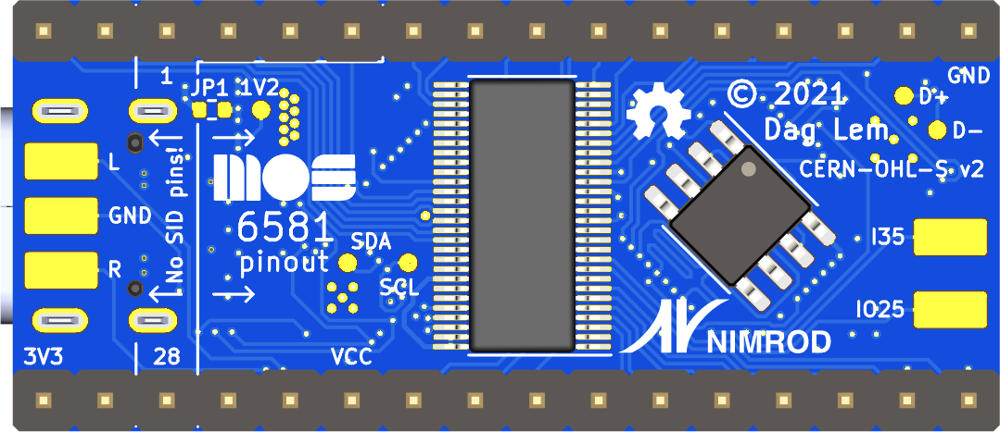

# reDIP sx

## ESP32 / iCE40UP5K / SGTL5000 development board with MOS 6581/8580 pinout

## Overview
The reDIP sx is a open source hardware development board which combines the following in a DIP-32 size package:

* ESP32-PICO-V3-02 MCU with Wi-Fi and Bluetooth
* iCE40UP5K FPGA
* SGTL5000 Audio Codec
* 64Mbit PSRAM
* Two RGB LEDs
* USB-C receptacle for power, serial, and analog audio
* 5V tolerant I/O

## General use

### I/O interfaces

#### Header pins:

* 5V input
* 3.3V output
* 22 FPGA GPIO
* 3 FPGA current drive / open-drain I/O, one with pullup
* 4 audio pins (stereo line input, stereo headphone output)
* GND

All FPGA I/O is 5V tolerant, and can drive 5V TTL. JP1 can be shorted to make the 5V input pin bidirectional, e.g. for powering 5V TTL devices.

The number of FPGA I/O is sufficient for e.g. 5 PMOD interfaces (or 6, with two pins open-drain or input-only).

#### Solder pads:

* Stereo line output (left, right, GND)
* ESP32 IO25
* ESP32 I35

#### USB-C functions:

* 5V power
* Serial interface (CP2102N to ESP32)
* Microphone input / stereo headphone output (Audio Accessory Mode)

### Internal interconnect buses

The board has three internal interconnect buses with the following ICs attached:

* SPI (Serial Peripheral Interface)
  * ESP32 MCU
  * iCE40UP5K FPGA
  * PSRAM
* I²S (Inter-IC sound)
  * ESP32 MCU
  * iCE40UP5K FPGA
  * SGTL5000 Audio Codec
* I²C (Inter-Integrated Circuit)
  * ESP32 MCU
  * iCE40UP5K FPGA
  * SGTL5000 Audio Codec

The MCU and the FPGA can communicate via the SPI bus, and they can both access the PSRAM. The FPGA is initially configured by the MCU via the SPI bus.

Both the MCU and the FPGA can act as either master or slave on the I²S bus. E.g. if the FPGA acts as the I²S master, both the audio codec and the MCU can in theory play back audio, the latter over Wi-Fi or Bluetooth.

Both the MCU and the FPGA can configure the audio codec via the I²C bus.

## MOS 6581/8580 SID compatibility

It just so happens that the board is mostly pin compatible with the venerable MOS 6581/8580 SID sound chip :wink:

For anyone wanting to experiment with a SID setup, while avoiding blown fuses, damaged sockets, and release of magic smoke:

* A 2A C64 power supply is recommended
* Make sure that JP1 is open
* Carefully follow the instructions in the [schematic diagram](documentation/reDIP-sx-sch.pdf) for making a socket adapter

## Disclaimer

Please note that this is my very first board - rookie mistakes are probably made, and feedback is welcome. The board has not been manufactured yet, and is thus completely untested.

## Board Front

## Board Back

